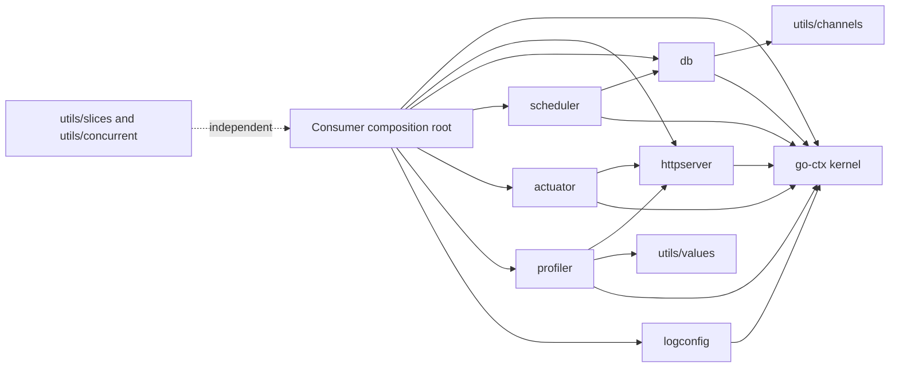

# go-ctx-base Architecture

This document describes the repository architecture as implemented and reviewed on
2026-07-22. The [project constitution](../.specify/memory/constitution.md) defines mandatory
engineering constraints; this guide maps them to packages, runtime behavior, configuration,
and current risks.

## System Scope

`go-ctx-base` is a reusable infrastructure-adapter module for contextualized Go applications.
It adds HTTP serving, database access, scheduling, diagnostics, profiling, logging setup, and
generic utilities to the service container supplied by `github.com/sedmess/go-ctx`.

The repository is not a business application and does not own domain models or workflows.
Consumers select packages, add domain services, and assemble one application at their
composition root. The root `app_example.go` demonstrates that assembly model.

The current compatibility baseline is:

- Go 1.26 or later;
- `github.com/sedmess/go-ctx` v0.12.0;
- one active `go-ctx` application context per process;
- SQLite or PostgreSQL through GORM;
- HTTP through `go-json-rest` and `net/http`;
- scheduling through `gocron`;
- structured logging through `slog`;
- metrics through Prometheus.

## Framework Foundation: go-ctx v0.12.0

`go-ctx` is the architecture kernel, not merely a helper dependency. This repository inherits
its public contracts for service registration, dependency injection, environment loading,
health, statistics, lifecycle, and testing.

The version-matched framework references are:

- [go-ctx v0.12.0 README](https://github.com/sedmess/go-ctx/blob/v0.12.0/readme.md)
- [go-ctx v0.12.0 architecture](https://github.com/sedmess/go-ctx/blob/v0.12.0/docs/architecture.md)
- [go-ctx v0.12.0 migration guide](https://github.com/sedmess/go-ctx/blob/v0.12.0/docs/migration-v0.12.0.md)
- [Go package reference](https://pkg.go.dev/github.com/sedmess/go-ctx)

The inherited rules most relevant here are:

1. `ctx.PackageOf` contributes service instances to an application. Service names are unique,
   `CTX` is reserved, and reflected services are pointers to structs.
2. `ctx` fields inject services, loggers, the application context, or the root context. `env`
   fields inject typed configuration.
3. `AfterStart` callbacks are concurrent and have no ordering guarantee. `BeforeStop` callbacks
   are sequential in consumer-before-dependency order. Disposal is concurrent.
4. `Application.Stop` is immediate and idempotent. `Application.Join` waits for all framework-
   owned shutdown work.
5. Global lookup is designed for one active application context per process. Restart after a
   completed stop is supported; simultaneous contexts are not an isolation boundary.
6. Configuration is loaded lazily. Defaults must be registered before the first lookup.
7. Missing typed lookup returns `(zero, false)`; callers must inspect the boolean.

Any base adapter that conflicts with these rules is defective; it must not redefine the
framework contract locally.

## Package Topology



| Package | Responsibility | Dependency rule |
|---------|----------------|-----------------|
| `httpserver` | REST server, route builders, middleware, auth helpers, request limits, graceful shutdown, and HTTP metrics | May depend on `go-ctx`, HTTP libraries, and Prometheus; must not own domain logic |
| `db` | Named GORM connections, SQLite/PostgreSQL selection, sessions, transactions, pagination, streams, health, and DB metrics | May depend on `go-ctx` and `utils/channels` |
| `scheduler` | Cron execution and local or PostgreSQL advisory locking | May depend on `go-ctx` and `db` |
| `actuator` | Health, service-topology, and Prometheus endpoints | May depend on `go-ctx` and `httpserver` |
| `profiler` | Trace, CPU profile, and named runtime profile endpoints | May depend on `go-ctx`, `httpserver`, and `utils/values` |
| `logconfig` | Process-global `slog` fan-out and optional file rotation | May depend on `go-ctx`; import-time effects must remain documented |
| `utils/channels` | Generic streaming values and errors | Must remain independent of `go-ctx` and adapter packages |
| `utils/concurrent` | Semaphore-backed execution pools | Must remain independent of `go-ctx` and adapter packages |
| `utils/slices` | Generic slice transformations | Must remain independent of `go-ctx` and adapter packages |
| `utils/values` | Pointer and optional-value helpers | Must remain independent of `go-ctx` and adapter packages |
| root `main` package | Runnable example and consumer-level integration test | May compose public packages; must not become shared framework code |

The module also contains helpers with names similar to `go-ctx/utils/*`. They are different
public packages with different import paths and contracts. Replacing or consolidating them is
a compatibility migration, not an internal refactor.

## Assembly and Runtime Flow

The composition root supplies service packages to `ctx.CreateContextualizedApplication`:

```text
httpserver.Default()
db.Default()
scheduler.Default()
actuator.RunAsIndependentServer()
profiler.RunAsIndependentServer()
ctx.PackageOf(actuator.AddToDefaultHttpServer(), profiler.AddToDefaultHttpServer())
ctx.PackageOf(application services...)
```

Choose either each independent package or the corresponding controller inside
`ctx.PackageOf` when mounting it on an existing server; do not register both forms for the same
component.

`Default` packages cache a package, and therefore its service instances, with
`sync.OnceValue`. Custom constructors are required when an application needs separately named
servers or database connections.

The runtime sequence is:

1. Packages register services with `go-ctx`.
2. `go-ctx` resolves dependencies and injects `ctx` and `env` fields.
3. Adapter `Init` methods construct provisional resource generations, reserve HTTP listeners, and
   register routes or scheduled jobs. A local failure disposes provisional state before returning.
4. Concurrent `AfterStart` callbacks serve the already reserved listeners and start the scheduler.
5. The application serves until explicit stop or a catchable process signal.
6. Dependency-ordered `BeforeStop` callbacks stop the scheduler and gracefully shut down HTTP
   servers before framework cancellation and disposal complete.
7. `Join` returns only after the framework's complete shutdown sequence.

Routes and middleware must be registered before the target server enters `AfterStart`; later
registration does not rebuild the active router. Services must not rely on `AfterStart` order.

## Configuration Model

`go-ctx` resolves configuration from highest to lowest precedence:

1. exact process environment name;
2. uppercase process environment fallback;
3. `--NAME=value` command arguments;
4. `.env_custom`;
5. `.env`;
6. defaults registered with `ctx.SetEnv`.

`GetEnvCustomOrDefault(prefix, key)` first checks `PREFIX_KEY`, then `KEY`.
`GetEnvCustom(prefix, key)` checks only `PREFIX_KEY`.

| Component | Primary namespace | Fallback and notes |
|-----------|-------------------|--------------------|
| Default HTTP server | `BASE_HTTP_LISTEN`, `BASE_HTTP_MAX_HEADER_SIZE`, `BASE_HTTP_READ_TIMEOUT`, `BASE_HTTP_WRITE_TIMEOUT` | Falls back to the corresponding `HTTP_*` key |
| Request body limit | `HTTP_MAX_REQUEST_SIZE` | Currently global across all server instances |
| Default database | `BASE_DB_*` | Falls back to `DB_*`; accepts DSN, PostgreSQL fields, or `DB_SQLITE_PATH` |
| Actuator server | `ACTUATOR_HTTP_*` | Listener settings fall back to `HTTP_*`; default listen address is `127.0.0.1:8089` |
| Actuator access | `ACTUATOR_HTTP_AUTH_TOKENS` | Exact-only comma-separated tokens; no fallback |
| Profiler server | `PROFILER_HTTP_*` | Listener settings fall back to `HTTP_*`; default listen address is `127.0.0.1:8099` |
| Profiler access | `PROFILER_HTTP_AUTH_TOKENS` | Exact-only comma-separated tokens; no fallback |
| Scheduler | `SCHEDULER_LOCK_PROVIDER` | `LOCAL` by default; `POSTGRES` uses `SCHEDULER_DB_*` without global DB fallback |
| Logging | `LOG_LEVEL`, `LOG_FILE_PATH`, and `LOG_FILE_*` rotation settings | Configured process-wide by `logconfig` |

When more than one HTTP server is composed, set distinct namespaced listen addresses. A shared
`HTTP_LISTEN` value is inherited by the default, actuator, and profiler servers; an incompatible
duplicate now fails during initialization before any route is reported ready. A present-empty
listen value remains present and preserves `net/http`'s empty-address behavior.

Configuration values containing credentials or DSNs must not appear in logs, metrics, health
details, examples, or committed environment fixtures.

## Adapter Boundaries

### HTTP server

The built-in server resolves configuration and reserves its real TCP listener during error-returning
initialization. Controllers register validated typed or raw handlers before `AfterStart`, which
freezes the generation route set and calls `Serve` on the reserved listener. Shutdown first cancels
the generation request context, then uses the existing five-second graceful bound and joins the
serve worker. Disposal repeats cleanup safely for initialization rollback, later-service failure,
and restart. Persistent pre-initialization routes and middleware survive; generation registrations
do not accumulate.

Authentication middleware controls access and stores a request-scoped Murmur3-derived `int64`
identity. Bearer retains its established value; Basic now derives the same numeric representation
from the username and never stores the password. Missing or invalid state reads as zero.

### Database

`Connection` selects PostgreSQL from a DSN or complete field set, otherwise SQLite from a
configured path. `SessionContext` propagates caller cancellation into GORM. Nested `Session.Tx`
calls reuse an existing transaction; top-level calls create a GORM transaction. Health performs
a five-second query and reports critical or noncritical failure according to connection setup.

Each SQL connection pool, generation context, and Prometheus registration is published and closed
as one lifecycle unit. `SessionContext` combines caller and generation cancellation before pool
acquisition. The nine `gorm_dbstats_*` values are pulled from `sql.DB.Stats()` at scrape time, so no
refresh worker survives a pool. `CloseConnection` is additive for manual owners; container-managed
instances call the same idempotent cleanup automatically. Models, schema migration policy, and
domain queries remain consumer responsibilities.

### Scheduler and locks

`Scheduler` creates a fresh generation context, starts asynchronously, and cancels context-aware
jobs before waiting in `BeforeStop`. The local and PostgreSQL lockers own close-once leases that
release on explicit unlock, caller cancellation, or locker shutdown. PostgreSQL uses the preserved
transaction-scoped advisory query: explicit unlock commits, while cancellation or failure rolls
back. Lease workers join before the exact-only scheduler database closes.

### Actuator and profiler

Actuator exposes:

- `/actuator/health`
- `/actuator/health/plain`
- `/actuator/services`
- `/actuator/metrics`

Profiler exposes runtime trace, CPU profile, and named-profile endpoints under `/profiler`.
Actuator and profiler remain unauthenticated only when the actual reserved listener is proven
loopback-only. A valid exact component token list protects every owned route; nonlocal or
uninspectable exposure without it fails initialization. Reverse-proxied loopback endpoints are
operationally external and must configure tokens. Profiler validates input before admission,
limits HTTP captures to 30 seconds, and uses one process-wide nonblocking gate with request/server
cancellation and deferred runtime cleanup.

### Logging and metrics

`logconfig` installs a process-global fan-out handler at package initialization and may add a
rotating file handler. Consumers may call `InitWithExtraHandlers` to replace that setup.
Prometheus collectors are also process-global. HTTP metric family and label names are retained,
but registered handlers attach their finite route expression before route middleware. The outer
collector reads that expression after handling, uses `unmatched` when no handler ran, and collapses
unsupported methods to `OTHER`; raw paths, queries, credentials, and identifiers never become
labels.

### Streaming utilities

`utils/channels` represents each item as either data or an error. Legacy producers retain their
drain-required behavior. Additive context-owned constructors, maps, flat maps, iteration, and
collection share one non-nil operation context; value and terminal-error sends observe cancellation,
preserve order/capacity, emit at most one error, and close producer-owned output. A consumer cancels
that shared context before abandoning a chain. `SessionContextStream` applies the same context to
pool work, pagination, page delivery, and terminal completion.

## Resolved Architecture Risks

The seven findings from the 2026-07-21 review are resolved under the ownership model above.

| Prior severity | Area | Status and corrective behavior | Passing evidence |
|---|---|---|---|
| HIGH | Test configuration and listener readiness | **Resolved.** Root tests reuse three prefixed endpoints for 100 complete application generations and probe all listener services. Incompatible duplicates fail before `AfterStart`, dispose initialized siblings, and leave the address reusable. | `TestRootCompositionRepeatedGenerations`, `TestRootCompositionDuplicateEndpointRollsBackBeforeReadiness`, `TestListenerConfigurationAndDuplicateBind`, `TestRestServerGenerationLifecycle` |
| HIGH | Resource lifecycle | **Resolved.** Pool/collector and scheduler/lease generations have idempotent stop/disposal, cancellation, join, rollback, and restart paths. | `TestConnectionProvisionalInitializationRollback`, `TestConnectionNormalContainerStopClosesGeneration`, `TestConnectionLaterServiceFailureDisposesGeneration`, `TestPostgresLockerCommitRollbackShutdownAndReacquisition`, `TestSchedulerStopsBeforeLockerClosesPrivateDatabase` |
| HIGH | Control plane and profiling | **Resolved.** Exact component tokens protect all owned routes; only proven loopback is open without tokens. Public factories retain their service wiring, and profiling is validated, bounded, cancelable, capacity one, and exactly-once cleaned up after a successful start. | `TestActuatorFactoriesPreserveObservableServiceWiring`, `TestProfilerFactoriesPreserveObservableServiceWiring`, `TestProfilerRuntimeCleanupExactlyOnce`, `TestProfilerClientAndServerCancellationReleaseAdmission` |
| HIGH | Authentication contract | **Resolved.** Bearer and Basic produce the same deterministic numeric identity; every unsuccessful case retains zero credential state and captured output excludes the supplied secrets. | `TestAuthenticationMethodsShareFailureAndSecretSafeContract`, `TestBearerAuthenticationContract`, `TestCredentialHashIsDeterministicAcrossProcesses` |
| MEDIUM | Streaming cancellation | **Resolved additively.** Context-owned stages interrupt blocked sends/receives and terminal-error delivery, then close within two seconds; legacy APIs remain drain-required. | `TestContextStreamsCancelBeforeAndAfterSends`, `TestContextStreamCancellationImmediatelyAfterGeneratorError`, `TestContextTransformsCancelBlockedReceiveAndPreserveOrder`, DB stream cancellation tests, race suite |
| MEDIUM | Metrics cardinality | **Resolved.** Route expressions/`unmatched` and the finite method set replace request-controlled label values. | `TestHTTPMetricsUseFiniteRouteMethodAndExistingUnits`, `TestHTTPMetricCardinalityIsBoundedAcrossTenThousandTargets` |
| MEDIUM | Verification breadth | **Resolved.** Direct tests now cover every previously untested package plus lifecycle failure and race paths. | `go test -count=3 ./...`, `go vet ./...`, and `go test -race ./...` all pass |

The optional PostgreSQL provider test compiles and was invoked, but explicitly skipped because
`GO_CTX_BASE_TEST_POSTGRES_DSN` was not configured. `TestPostgresLockerDeterministicAcquisitionFailures`,
`TestPostgresLockerCommitRollbackShutdownAndReacquisition`, and
`TestPostgresLockerTransactionFailureReleasesLease` provide deterministic state-machine proof;
the repository does not claim live-server proof for this run.

## Verification and Documentation

Required repository gates are:

```text
gofmt -w path/to/edited_file.go
go build ./...
go test ./...
go vet ./...
go test -race ./...  # lifecycle, server, database, lock, stream, or concurrency changes
```

At the completed remediation baseline on 2026-07-22, `go build ./...`, three consecutive full test
runs, `go vet ./...`, and `go test -race ./...` all pass. The optional integration-tagged PostgreSQL
test reports a skip when its explicit test DSN is absent; it does not replace deterministic lock
coverage.

Tests remain beside the package they cover. Consumer-level composition tests should use
`go-ctx/ctx/ctx_testing`, explicit service substitution, and distinct namespaced environment
values. Public contract changes require synchronized updates to this guide, `readme.md`, package
comments, examples, and migration guidance when compatibility is affected.

## Architecture Change Checklist

Before implementation, answer these questions in the feature specification and plan:

1. Which exported identifier, service name, route, environment key, metric, or failure mode
   changes?
2. Does the change preserve the package graph and `go-ctx` v0.12.0 runtime contract?
3. Who owns and stops every new listener, pool, transaction, goroutine, channel, timer, lock,
   profile, or process-global registration?
4. How do initialization failure, cancellation, repeated stop, and restart behave?
5. Are control-plane exposure, authentication identity, secrets, and telemetry cardinality safe?
6. Which unit, integration, failure-path, and race tests prove the contract?
7. Which README, architecture, package comment, example, or migration document must change?

Any exception to the constitution must be documented in the implementation plan's Complexity
Tracking section before implementation begins.
